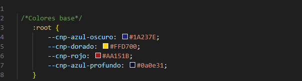
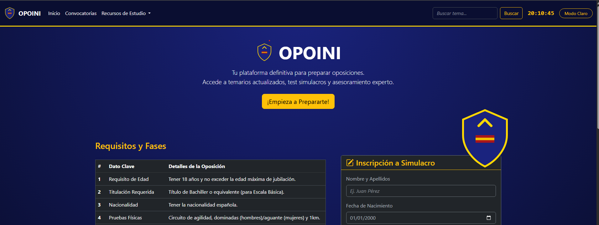

# Documentación del Proyecto **OPOINI**

## 1. Descripción General

OPOINI es una web orientada a la preparación de oposiciones, desarrollada como práctica avanzada de **HTML, CSS, JavaScript y Bootstrap 5**. Combina un diseño visual corporativo con múltiples funcionalidades interactivas enfocadas al usuario.

---

## 2. Tecnologías Utilizadas

* **HTML5** – Estructura semántica
* **CSS3** – Estilos personalizados y variables CSS
* **Bootstrap 5.3** – Diseño responsive y componentes UI
* **Bootstrap Icons** – Iconografía
* **JavaScript (ES6)** – Lógica, validaciones e interactividad
* **LocalStorage** – Persistencia de preferencias de usuario

---

## 3. Identidad Visual y Estilo

### 3.1 Paleta de Colores

* Azul oscuro corporativo
* Azul profundo de fondo
* Dorado institucional
* Rojo corporativo

*(Definidos mediante variables CSS)*



### 3.2 Estilo General

* Fondo con degradado radial fijo
* Tipografía clara sobre fondo oscuro
* Componentes con bordes dorados
* Animaciones suaves en hover





## 4. Estructura de la Web

### 4.1 Barra de Navegación (Navbar)

**Funcionalidades:**

* Logo SVG corporativo
* Menú de navegación principal
* Dropdown de recursos
* Buscador de contenidos
* Reloj digital en tiempo real
* Botón de cambio de tema claro/oscuro

📸 **Espacio para imagen:**


---

### 4.2 Hero Section

* Presentación principal de la plataforma
* Llamada a la acción (CTA)
* Imagen y mensaje motivacional

📸 **Espacio para imagen:**


## 5. Funcionalidades Dinámicas

### 5.1 Cambio de Tema Claro / Oscuro

* Uso de `data-bs-theme`
* Persistencia con `localStorage`
* Cambio dinámico del texto del botón

📸 **Espacio para imagen:**


### 5.2 Reloj Digital

* Actualización cada segundo
* Formato 24h
* Implementado con `setInterval`

📸 **Espacio para imagen:**

```

```

---

### 5.3 Tabla Dinámica de Requisitos

* Generación dinámica desde array JS
* Búsqueda y filtrado por texto
* Actualización sin recargar la página

📸 **Espacio para imagen:**

```

```

---

### 5.4 Buscador de Tabla

* Filtra por clave o descripción
* Integrado en el navbar

📸 **Espacio para imagen:**

```

```

---

### 5.5 Carrusel de Imágenes

* Bootstrap Carousel
* Imágenes responsivas
* Efecto zoom y sombreado

📸 **Espacio para imagen:**

```

```

---

## 6. Formulario de Inscripción

### 6.1 Campos del Formulario

* Nombre completo
* Fecha de nacimiento
* Correo electrónico
* Escala de oposición
* Nivel de preparación
* Observaciones
* Checkbox de aceptación

📸 **Espacio para imagen:**

```

```

---

### 6.2 Validaciones en Tiempo Real

* Validación de nombre (solo letras)
* Validación de correo (.es / .com)
* Validación de mayoría de edad (+18)
* Feedback visual con Bootstrap

📸 **Espacio para imagen:**

```

```

---

### 6.3 Envío y Limpieza

* Toast al enviar formulario correctamente
* Toast al limpiar campos
* Limpieza de estados y mensajes de error
* Almacenamiento temporal en array JS

📸 **Espacio para imagen:**

```

```

---

## 7. Componentes Visuales Adicionales

### 7.1 Cards Informativas

* Servicios
* Características
* Funcionalidades
* Efecto hover con sombra dorada

📸 **Espacio para imagen:**

```

```

---

### 7.2 Placa SVG Arrastrable

* Elemento decorativo interactivo
* Movimiento libre con mouse
* Siempre visible sobre el contenido

📸 **Espacio para imagen:**

```

```

---

## 8. Calculadora de Nota Física

### 8.1 Modal de Calculadora

* Apertura desde botón flotante
* Entrada de datos físicos
* Cálculo automático de media

📸 **Espacio para imagen:**

```

```

---

### 8.2 Lógica de Cálculo

* Conversión de tiempos
* Asignación de puntos
* Resultado visual con alertas

📸 **Espacio para imagen:**

```

```

---

## 9. Footer

* Información del autor
* Enlaces a redes sociales
* Estilo consistente con el navbar

📸 **Espacio para imagen:**

```

```

---

## 10. Conclusión

OPOINI es un proyecto completo que integra diseño moderno, interactividad avanzada y buenas prácticas de desarrollo frontend, ideal como proyecto académico o base para una plataforma real de preparación de oposiciones.

---

✍️ **Autor:** Iñigo Hernandez
